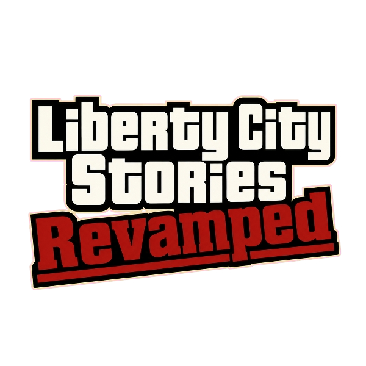

<p align="center">
  
</p>
  
An open-world crime sandbox inspired by the classic 3D-era reverse-engineering project *reVC*.<br> 
This project aims to fully revive *Grand Theft Auto: Liberty City Stories*, re-engineering the 2000s underworld with `librw` performance, <br>
native widescreen support, and classic mob-war aesthetics - while remaining open, moddable, and community-driven.

---

## 02. How can I try it?

- Liberty City Stories: Revamped strictly requires original, legally owned game assets to function.
- Compile Liberty City Stories: Revamped from provided source code in this repository. (pre-compiled binaries will be available in the future).
- Copy the files from `/assets/game_lcsr` directly into your game's root directory.
- Move the compiled executable (`lcsr.exe`) into your *Grand Theft Auto: Liberty City Stories* root directory and run it.

---

## 03. Preparing the environment for building

> [!NOTE]  
> Currently, only Windows builds are officially supported.

### Prerequisites
* [Visual Studio Community 2026](https://visualstudio.microsoft.com/)

### Instructions
1. **Clone the repository** (including all submodules):
  ```sh
    git clone git@github.com:siouxxsta/lcsr.git --recursive
    cd lcsr
    git submodule update --init --recursive
  ```
2. Generate the project files by running the automated PowerShell script located in `scripts/Invoke-Premake.ps1`.
3. Open the solution located in the `build/` directory using Visual Studio to compile.

### Configuration

You can customize your build via the settings located in [src/core/config.h](https://github.com/siouxxsta/lcsr/tree/master/src/core/config.h).<br>
**Tip:** Enabling `#define FIX_BUGS` applies community engine and gameplay bug fixes.

### The Rendering Engine (librw)
Liberty City Stories: Revamped utilizes a completely homebrew RenderWare-replacement rendering engine called [librw](https://github.com/aap/librw/).

- By default, librw is included as a project submodule.
- If you prefer to use a `custom implementation`, you can specify your path using the `LIBRW` environment variable.

---

## 04. Contributions
We welcome community contributions! ;)<br>
**Before submitting a Pull Request, please read [Coding Style Guide](https://github.com/siouxxsta/lcsr/blob/master/docs/CODING_STYLE.md) to ensure consistency across the codebase.**

---

## 05. Legal Notice
**Liberty City Stories: Revamped is an independent, fan-driven project.
It is not affiliated with, authorized, maintained, or endorsed by Rockstar Games, Take-Two Interactive, or any of their affiliates.
To use this software, you must own a legal copy of the original game. 
All trademarks, copyrights, and intellectual property belong to their respective owners.**
